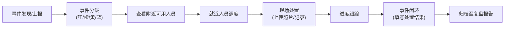

## 1. 产品概述

公共安全管理 Web 应用是一款面向大型活动现场安保指挥的综合管理平台。系统通过可视化大屏、实时数据监控和智能化调度，帮助安保指挥中心高效协调人员、处置突发事件、保障活动安全有序进行。

- 核心目标：提升大型活动安保指挥效率，实现人员、点位、任务、事件、物资的全流程数字化管理
- 目标用户：安保总指挥、现场指挥员、安保管理人员、后勤保障人员
- 产品价值：降低指挥沟通成本，提高应急响应速度，实现安保工作可追溯、可复盘

## 2. 核心功能

### 2.1 用户角色

| 角色 | 说明 | 核心权限 |
|------|------|----------|
| 总指挥 | 活动安保最高负责人 | 查看所有数据、全局调度、审批决策 |
| 现场指挥员 | 负责片区/区域指挥 | 区域人员调度、事件处置、任务分配 |
| 安保管理员 | 日常管理操作人员 | 人员管理、点位维护、物资管理 |
| 后勤人员 | 物资装备管理 | 装备领用归还、库存管理 |

### 2.2 功能模块

1. **总览大屏**：活动全局态势、实时数据监控、异常预警、关键指标展示
2. **人员管理**：安保人员档案、签到管理、岗位分配、实时位置
3. **风险点位**：会场区域划分、风险点位标注、警戒线/出入口设置、隐患登记
4. **巡逻任务**：巡逻路线制定、任务派发、进度跟踪、打卡记录
5. **事件处置**：事件上报、分级处理、就近调度、处置进度、对讲记录
6. **物资装备**：装备台账、领用归还、库存预警、盘点统计
7. **复盘报告**：时间线复盘、日报生成、数据统计、事件归档

### 2.3 页面详情

| 页面名称 | 模块名称 | 功能描述 |
|-----------|-------------|---------------------|
| 总览大屏 | 态势监控 | 活动整体数据概览、实时人员/事件/物资统计卡片 |
| 总览大屏 | 地图展示 | 会场平面图、人员位置、风险点位、巡逻路线可视化 |
| 总览大屏 | 预警提示 | 异常聚集、超时未处置事件、低库存物资等告警 |
| 总览大屏 | 实时动态 | 事件流、人员签到、任务完成等实时动态展示 |
| 人员管理 | 人员列表 | 安保人员信息管理、筛选、搜索 |
| 人员管理 | 签到管理 | 人员签到记录、签到状态、考勤统计 |
| 人员管理 | 岗位分配 | 按区域/岗位分配人员、调整部署 |
| 风险点位 | 区域管理 | 会场区域划分、颜色标注、边界绘制 |
| 风险点位 | 点位标注 | 风险点、出入口、警戒线在地图上标注 |
| 风险点位 | 隐患登记 | 隐患上报、图片上传、处理跟踪 |
| 巡逻任务 | 路线管理 | 巡逻路线规划、点位设置、时间安排 |
| 巡逻任务 | 任务派发 | 任务分配给人员、设置频次和时间 |
| 巡逻任务 | 执行跟踪 | 巡逻打卡记录、异常上报、任务完成率 |
| 事件处置 | 事件列表 | 事件分级展示（红/橙/黄/蓝）、筛选过滤 |
| 事件处置 | 事件详情 | 事件信息、现场照片、处置记录、时间线 |
| 事件处置 | 人员调度 | 查看附近人员、一键派单、调度记录 |
| 事件处置 | 对讲记录 | 语音对讲文字记录、时间戳、关联事件 |
| 物资装备 | 装备台账 | 装备信息管理、分类、编号 |
| 物资装备 | 领用归还 | 人员领用登记、归还验收、状态跟踪 |
| 物资装备 | 库存管理 | 库存预警、盘点、出入库记录 |
| 复盘报告 | 时间线复盘 | 活动全流程时间轴、关键事件标记 |
| 复盘报告 | 日报生成 | 每日数据统计、自动生成报告、导出 |
| 复盘报告 | 数据统计 | 人员到岗率、事件处理率、物资使用率等 |

## 3. 核心流程

### 3.1 事件处置流程

### 3.2 巡逻任务流程

### 3.3 物资领用流程

## 4. 用户界面设计

### 4.1 设计风格

- **主色调**：深蓝科技感 (#0F172A) 作为主背景，搭配警蓝 (#1E40AF) 作为主色调
- **辅助色**：危险红 (#EF4444)、警告橙 (#F59E0B)、关注黄 (#EAB308)、安全绿 (#10B981) 用于事件分级
- **中性色**：深灰 (#1E293B)、中灰 (#475569)、浅灰 (#94A3B8)、白色 (#F8FAFC)
- **按钮风格**：直角硬朗风格，带细微边框和 hover 状态变化，强调专业感
- **字体**：标题使用 "JetBrains Mono" 等宽字体彰显科技感，正文使用 "Inter" 确保可读性
- **布局风格**：深色科技感大屏风格，卡片式布局，数据可视化图表丰富
- **图标**：使用 lucide-react 图标库，统一线性风格，蓝色主色调

### 4.2 页面设计概述

| 页面名称 | 模块名称 | UI 元素 |
|-----------|-------------|-------------|
| 总览大屏 | 态势监控 | 数据卡片、环形图、柱状图、实时数字跳动动画 |
| 总览大屏 | 地图展示 | SVG/Canvas 会场平面图，可缩放平移，人员点位标记 |
| 总览大屏 | 预警提示 | 左侧滚动告警列表，不同级别颜色区分，闪烁动画 |
| 总览大屏 | 实时动态 | 右侧时间轴流，事件/签到/任务更新动态展示 |
| 人员管理 | 人员列表 | 表格布局，头像、状态标签、筛选条件，行悬停高亮 |
| 人员管理 | 签到管理 | 日历热力图、签到状态饼图、签到记录列表 |
| 风险点位 | 区域管理 | 可交互地图，点击选中区域，属性编辑面板 |
| 巡逻任务 | 路线管理 | 地图上绘制路线，拖拽调整点位，时间轴设置 |
| 事件处置 | 事件列表 | 卡片式列表，不同级别背景色，紧急事件置顶闪烁 |
| 事件处置 | 事件详情 | 左右分栏，左侧事件信息，右侧处置时间线 |
| 物资装备 | 台账管理 | 分类标签页，表格展示，库存状态进度条 |
| 复盘报告 | 时间线 | 垂直时间轴，关键节点标记，可展开详情 |

### 4.3 响应式设计

- 采用桌面优先设计，适配 1920×1080 及以上大屏显示
- 侧边栏可折叠，适应不同屏幕宽度
- 表格支持横向滚动，确保小屏设备可用性
- 地图组件自适应容器大小，支持触摸缩放（移动端）
- 优化触控目标大小，确保平板设备可操作

### 4.4 视觉特效

- 页面加载：元素从下往上渐入，带轻微错位动画
- 数据更新：数字变化时平滑过渡，关键指标闪烁提示
- 告警事件：红色脉冲动画，引起注意
- 地图标记：人员位置带呼吸灯效果，巡逻路线动画流动
- 悬停效果：卡片上浮 + 阴影加深，按钮边框高亮
- 交互反馈：点击反馈涟漪效果，操作成功绿勾提示
