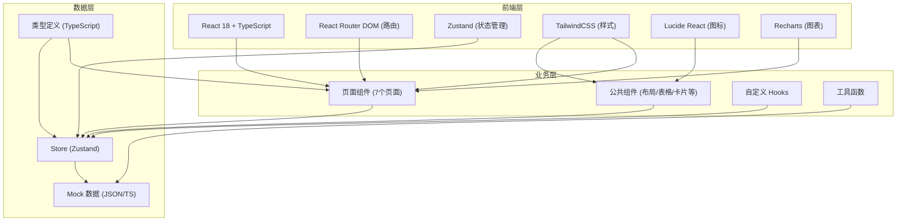
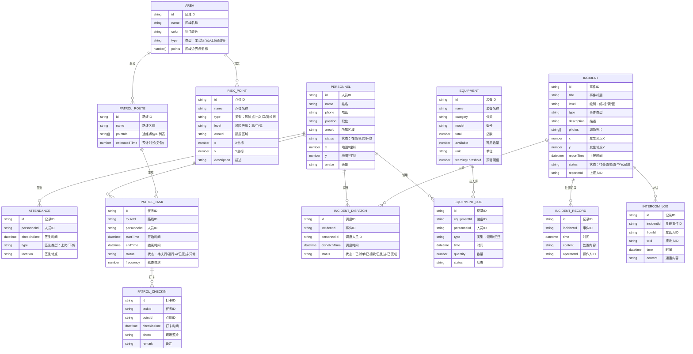

## 1. 架构设计



## 2. 技术描述

- **前端框架**：React@18 + TypeScript@5 + Vite@5
- **初始化工具**：vite-init
- **路由管理**：react-router-dom@6
- **状态管理**：zustand@4
- **UI 样式**：tailwindcss@3 + postcss + autoprefixer
- **图标库**：lucide-react@0.294
- **图表库**：recharts@2.10
- **后端**：无（纯前端应用，使用 Mock 数据）
- **数据存储**：LocalStorage 持久化 + 内存 Mock 数据

## 3. 路由定义

| 路由路径 | 页面名称 | 说明 |
|-------|---------|------|
| / | 总览大屏 | 系统首页，全局态势监控 |
| /personnel | 人员管理 | 安保人员信息与签到管理 |
| /risk-points | 风险点位 | 会场区域与风险点位管理 |
| /patrol | 巡逻任务 | 巡逻路线制定与任务跟踪 |
| /incidents | 事件处置 | 事件上报、调度与处置 |
| /equipment | 物资装备 | 装备台账与领用归还 |
| /review | 复盘报告 | 活动复盘与日报生成 |

## 4. 数据模型

### 4.1 数据模型定义



### 4.2 目录结构

```
src/
├── components/          # 公共组件
│   ├── Layout/         # 布局组件
│   ├── Card/           # 卡片组件
│   ├── Table/          # 表格组件
│   ├── Map/            # 地图组件
│   ├── Modal/          # 弹窗组件
│   └── Chart/          # 图表组件
├── pages/              # 页面组件
│   ├── Dashboard/      # 总览大屏
│   ├── Personnel/      # 人员管理
│   ├── RiskPoints/     # 风险点位
│   ├── Patrol/         # 巡逻任务
│   ├── Incidents/      # 事件处置
│   ├── Equipment/      # 物资装备
│   └── Review/         # 复盘报告
├── store/              # Zustand 状态管理
│   ├── usePersonnelStore.ts
│   ├── useIncidentStore.ts
│   └── ...
├── types/              # TypeScript 类型定义
│   └── index.ts
├── mock/               # Mock 数据
│   └── data.ts
├── utils/              # 工具函数
│   ├── date.ts
│   └── map.ts
├── hooks/              # 自定义 Hooks
│   └── useRealtime.ts
├── App.tsx
├── main.tsx
└── index.css
```

## 5. 核心技术方案

### 5.1 地图可视化方案

- 使用 SVG + React 实现可交互的会场平面图
- 支持缩放、平移、点位标记、区域高亮
- 人员位置实时更新动画
- 巡逻路线流动效果

### 5.2 实时数据模拟

- 使用 `setInterval` 模拟实时数据更新
- 人员位置随机漂移模拟移动
- 事件随机生成模拟突发情况
- LocalStorage 持久化关键数据

### 5.3 状态管理

- 使用 Zustand 管理全局状态
- 按业务领域拆分 Store（人员、事件、物资等）
- 支持状态持久化到 LocalStorage

### 5.4 响应式布局

- TailwindCSS 响应式工具类
- Grid + Flex 混合布局
- 侧边栏可折叠适配不同屏幕
